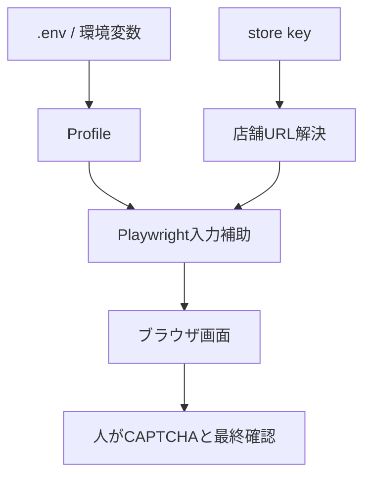

# Reservation Form Input Helper

個人利用のための予約フォーム入力補助ツールです。指定した店舗URLを開き、ユーザーが用意したプロフィール情報をフォームへ入力します。

このツールは **reCAPTCHA / CAPTCHA の突破、自動送信、大量申込、連続アクセス、予約枠の奪取** を行いません。入力後は必ず人が画面を確認し、CAPTCHA と最終送信を手動で行う設計です。

## できること

- 店舗URLを選んでブラウザを開く
- `.env` または環境変数に入れた情報をフォーム候補へ入力
- 個人情報同意・営業通知同意チェックボックスの候補をクリック
- CAPTCHA 直前で停止
- 入力内容確認ボタンは既定で押さない

## 対象URL

- 大阪: `https://reservation.rolexboutique-hiltonplaza-osaka.jp/osaka-umeda/reservation`
- 銀座: `https://reservation.rolexboutique-lexia.jp/ginza/reservation`
- 表参道: `https://reservation.rolexboutique-omotesando-tokyo.jp/omotesando/reservation?func_distinction=1`
- 新宿: `https://reservation.rolexboutique-lexia.jp/shinjuku/reservation`
- 名古屋栄: `https://reservation.rolexboutique-lexia.jp/nagoya-sakae/reservation`

## 使い方

```bash
python -m venv .venv
source .venv/bin/activate
pip install -r requirements.txt
playwright install chromium
cp .env.example .env
```

`.env` に自分の情報を入れます。

```bash
python -m reservation_input_helper --store ginza
```

ブラウザが開き、入力できる項目だけ入力します。最後は画面を見て、人が確認してください。

## 安全設定

既定では以下を行いません。

- CAPTCHA 操作
- CAPTCHA 回避
- 最終送信
- 連続申込
- 複数タブ同時実行

`--click-confirm` は入力内容確認ボタンを押すためのオプションですが、CAPTCHA 未完了の状態ではサイト側で先に進めない想定です。通常は使わないでください。

## テスト

```bash
pytest
ruff check .
```

## GitHub Actions

push / pull_request / workflow_dispatch で lint と test を実行します。

## 構成



## 注意

各サイトの利用規約、予約ルール、アクセス制限を守ってください。このリポジトリは入力補助だけを目的としています。
