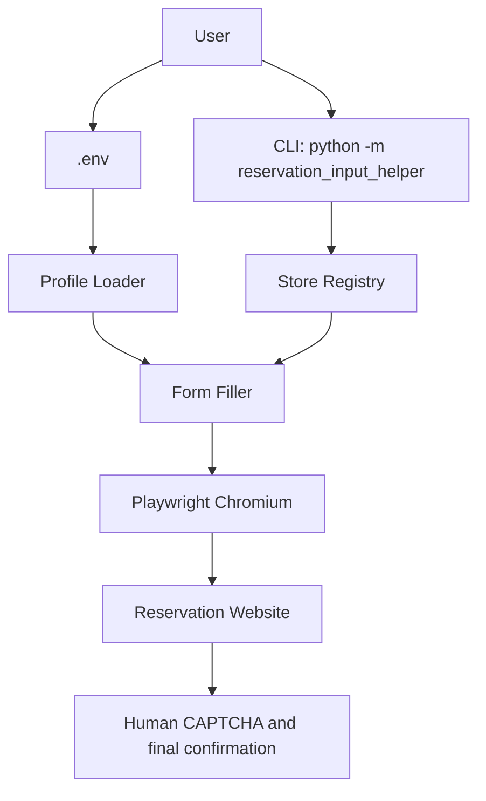

# Architecture

## 目的

予約フォームの入力を人の操作前提で補助します。CAPTCHA、CAPTCHA回避、最終送信、自動連続実行は対象外です。

## 全体像

## コンポーネント

- `reservation_input_helper/stores.py`: 店舗キーとURLの対応表
- `reservation_input_helper/profile.py`: `.env` / 環境変数から入力値を読み込む
- `reservation_input_helper/selectors.py`: フォーム項目の候補セレクタ一覧
- `reservation_input_helper/fill.py`: Playwrightで入力可能項目へ値を入れる
- `reservation_input_helper/__main__.py`: CLI

## 入力値

`.env` に保存します。実値は `.gitignore` によりGit管理対象外です。

## 安全境界

このツールは次をしません。

- reCAPTCHA iframe の操作
- CAPTCHA 解決API連携
- bot判定回避
- 自動送信
- 多重実行

## CI/CD

GitHub Actions で次を実行します。

1. checkout
2. Python setup
3. dependency install
4. ruff lint
5. pytest
6. artifact upload

## 拡張案

- フォームDOMのスクリーンショットからセレクタ候補を追加
- 店舗ごとのセレクタマッピングを個別定義
- 入力成功率レポートのJSON出力
